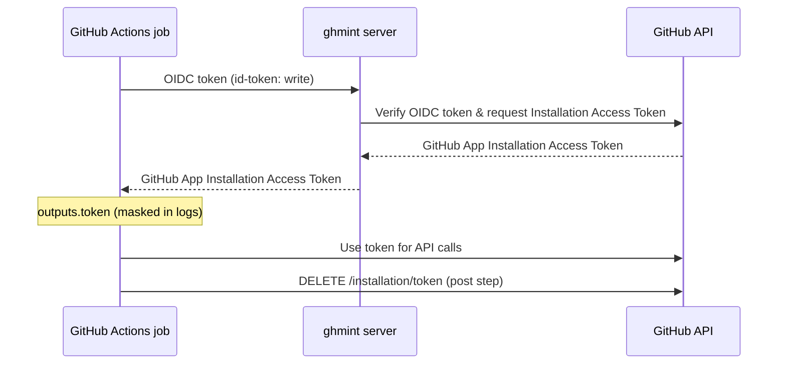

# ghmint-action

A GitHub Action that exchanges a GitHub Actions OIDC token for a GitHub App Installation Access Token via [ghmint](https://github.com/yagihash/ghmint).

## Overview

This action uses the [GitHub Actions OIDC token](https://docs.github.com/en/actions/security-for-github-actions/security-hardening-your-deployments/about-security-hardening-with-openid-connect) to authenticate with a ghmint server and obtain a scoped GitHub App Installation Access Token. The token is automatically revoked at the end of the job.



## Usage

```yaml
permissions:
  id-token: write  # required to obtain the OIDC token

jobs:
  example:
    runs-on: ubuntu-latest
    steps:
      - uses: yagihash/ghmint-action@be57533eef7f69550d06f0c93eede5589158281a # v1.0.0
        id: ghmint
        with:
          scope: my-org/my-repo
          policy: read-contents

      - name: Use the token
        run: gh api /repos/my-org/my-repo
        env:
          GH_TOKEN: ${{ steps.ghmint.outputs.token }}
```

## Inputs

| Name       | Required | Default             | Description                              |
|------------|----------|---------------------|------------------------------------------|
| `hostname` | No       | `sts.yagihash.dev`  | Hostname of the ghmint server            |
| `scope`    | Yes      | —                   | Token scope in `<org>` or `<org>/<repo>` format |
| `policy`   | Yes      | —                   | Policy name to use                       |

## Outputs

| Name    | Description                                      |
|---------|--------------------------------------------------|
| `token` | GitHub App Installation Access Token from ghmint |

## Security

- The token is masked with `::add-mask::` before being written to any output, so it never appears in plain text in logs.
- The SHA256 hash of the token is logged (base64-encoded) for auditing purposes without exposing the token itself.
- The post step automatically revokes the token via the GitHub API (`DELETE /installation/token`) after the job completes.
